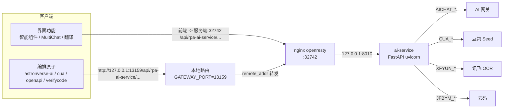

# AI 能力与 ai-service 说明（含修复方案）

> 适用分支：`feature/v1.1.6-base`（基线 `vendor/v1.1.6` = `8b015bc1`）
> 用途：① 说清"系统里有哪些 AI 能力、什么时候能用"；② 说清"调到了哪些内置/第三方 AI 接口、版本如何、要不要升级"；③ 说清"哪些功能依赖 ai-service"；④ 给出 ai-service 的重建/升级方案。
> 本文所有结论都附了可复现的核查命令（见附录 A），便于版本升级后重新核对。

---

## 0. 结论速览

1. **AI 能力有两大类、7 个入口**：编排用的 **27 个 AI 原子**（`astronverse-ai` 13 + `astronverse-cua` 5 + `astronverse-openapi` 6 + `astronverse-verifycode` 3），以及界面侧的 **智能组件 / 通用对话 / 名称翻译**。
2. **其中 22 个原子 + 全部界面 AI 功能都走 ai-service**；`astronverse-openapi` 的 6 个识别原子里，只有"通用文字识别"走 ai-service，另外 5 个票据识别是**客户端直连讯飞**（见 §3.3）。
3. **模型全部是"网关模型 id"**，不是厂商官方 id：默认 `maas/deepseek-v3.2`、推理档 `maas/kimi-k2-thinking`、CUA `doubao-seed-1-8-251228`。**能不能换模型由网关（`AICHAT_BASE_URL`）上架的目录决定，不是客户端说了算**——升级前必须先查网关 `/models`。
4. **ai-service 挂掉 = 全部 AI 能力瘫痪**（含客户端"优化提问"报 502），但**它没有 healthcheck**，容器会一直显示 `Up`，是当前最需要加固的地方。
5. **修复 ai-service 有两步**：源码侧已完成（补 `pytz`，见 §4.2）；镜像侧要么"钉上游 digest 救急"（0 构建），要么"用 GitHub Actions 自建镜像"（正式），推荐先救急再转正式。

---

## 1. 系统里有哪些 AI 能力、什么情况下可以调用

### 1.1 能力全景

| 能力组 | 原子（UI 名称） | 能做什么 | 依赖 |
|---|---|---|---|
| 对话/文本<br>`astronverse-ai`（13 个） | `ChatAI.single_turn_chat` 单轮对话<br>`ChatAI.chat` 多轮对话<br>`ChatAI.knowledge_chat` 知识库问答 | 单轮问答；多轮上下文问答；先检索知识库再答 | ai-service `/v1/chat/completions`<br>（多轮会弹交互窗口） |
| 垂类抽取<br>同上 | `ContractAI.get_factors` 合同要素提取<br>`RecruitAI.generate_keywords` 简历关键词<br>`RecruitAI.rating_resume` 简历评分 | 从合同/简历里抽结构化字段 | ai-service `/v1/chat/prompt` |
| 文档加工<br>同上 | `DocumentAI.theme_expand` 主题扩写<br>`DocumentAI.sentence_expand` 句子扩写<br>`DocumentAI.sentence_reduce` 句子缩写 | 文案扩写/缩写 | ai-service `/v1/chat/prompt` |
| 外部智能体<br>同上 | `Agent.call_dify` 调 Dify 工作流<br>`Agent.call_dify_chatflow` 调 Dify 对话流<br>`Agent.call_xcagent` 调星辰 Agent<br>`Agent.call_astron_agent` 调 Astron Agent | 把外部智能体编排进流程 | Dify `api.dify.ai/v1`（可自定义）<br>星辰 `xingchen-api.xf-yun.com`<br>Astron Agent 走平台 `rpa-openapi` 取密钥 |
| 屏幕智能体<br>`astronverse-cua`（5 个） | `ComputerUse.run` 计算机使用代理<br>`ComputerUse.custom_action_screen` 自定义 AI 操作屏幕<br>`ComputerUse.extract_data` 提取屏幕数据<br>`ComputerUse.fill_form` 填写表单<br>`ComputerUse.process_captcha` 处理验证码 | 用大模型"看图操作屏幕"，适合没有 API/元素定位不稳的老系统 | ai-service `/cua/chat` → 豆包 Seed |
| 识别类<br>`astronverse-openapi`（6 个） | `OpenApi.common_ocr` 通用文字识别 | 整页文字识别，返回全文 | ai-service `/ocr/general` → 讯飞 |
| 识别类<br>同上 | `OpenApi.id_card` 身份证<br>`OpenApi.business_license` 营业执照<br>`OpenApi.vat_invoice` 增值税发票<br>`OpenApi.train_ticket` 火车票<br>`OpenApi.taxi_ticket` 出租车发票 | 票据/证件模板抽取 | **客户端直连讯飞**（见 §3.3，当前凭据为空，见附录 B-1） |
| 验证码<br>`astronverse-verifycode`（3 个） | `VerifyCode.picture_code` 通用数英<br>`VerifyCode.slider_code` 通用滑块<br>`VerifyCode.click_code` 通用点击 | 打码平台代答 | ai-service `/jfbym/customApi` → 云码 |
| 界面：智能组件 | 右侧"智能组件"面板：**优化提问 / 生成组件 / 修复组件**，以及智能组件版本管理 | 在编辑界面让 AI 帮你写 RPA 流程 | 前端 → ai-service `/smart/chat`、`/smart/chat/stream` |
| 界面：通用对话 | `MultiChat` 对话窗口（SSE 流式） | 流程里的多轮对话节点 + 人工对话 | 前端 → ai-service `/v1/chat/completions` |
| 界面：名称翻译 | 机器人/流程名称一键翻译 | 中英互转 | 前端 → ai-service `/v1/chat/prompt`（`prompt_type=translate`） |

> 原子清单来自各组件 `meta.json`；界面功能来自前端调用点（附录 A-1）。

### 1.2 两类触发方式的差别

| | 编排原子（27 个） | 界面 AI 功能 |
|---|---|---|
| 谁触发 | 流程运行到该原子时自动调 | 人在编辑器里点按钮时调 |
| 是否阻塞 | `ChatAI.chat` / `ChatAI.knowledge_chat` 会**弹出交互窗口并阻塞**等待人工输入；其余原子不阻塞 | 不阻塞（流式返回） |
| 适用场景 | 批量、无人值守（发票批量抽取、简历批量初筛、老系统操作） | 开发期辅助（写流程、改流程、翻译命名） |
| 前置条件 | ai-service 可达 + 对应模型在网关已上架 + 原子所需凭据已配 | 同左 |

### 1.3 共同前置条件（失败时先查这三条）

1. **ai-service 必须在跑且 8010 有监听**（2026 年那次 502 就是它挂了，见 §4.1）；
2. **模型必须在网关目录里**：原子参数里 `model` 的候选值写死在 `astronverse-ai/__init__.py` 的 `LLMModelTypes`（`maas/deepseek-v3.2` / `maas/kimi-k2-thinking` / `custom`，选 `custom` 可手填任意模型 id）——**属于网关命名空间，不是厂商官方 id**；
3. **第三方凭据**：讯飞（OCR）、云码（验证码）、豆包（CUA）、Dify/星辰（外部 Agent）分别有各自开关，缺了会报"ai服务请求异常"之类的错。

---

## 2. 调用了哪些内置/第三方 AI 接口、版本如何、是否需要更新

### 2.1 接口清单

| # | 能力 | 提供方 | 端点（默认值） | 模型 / 版本 | 配置项 |
|---|---|---|---|---|---|
| 1 | 统一大模型 | **由 `AICHAT_BASE_URL` 决定**（设计上是 MaaS 聚合网关，OpenAI 兼容） | `AICHAT_BASE_URL` + `/chat/completions`、`/models` | `maas/deepseek-v3.2`（默认）<br>`maas/kimi-k2-thinking`（推理档） | `AICHAT_BASE_URL`、`AICHAT_API_KEY` |
| 2 | 计算机使用代理 | 火山方舟（豆包） | `CUA_BASE_URL` | `doubao-seed-1-8-251228` | `CUA_BASE_URL`、`CUA_API_KEY`（代码里为 `CUA_KEY`/`CUA_ENDPOINT`） |
| 3 | 通用文字识别 | 讯飞开放平台·通用文字识别 | `https://api.xf-yun.com/v1/private/sf8e6aca1` | 接口级服务 id（无版本号语义） | `XFYUN_APP_ID`/`XFYUN_API_KEY`/`XFYUN_API_SECRET` |
| 4 | 票据/证件识别 | 讯飞开放平台·模板 OCR | 客户端直连 `api.xf-yun.com/v1/private/`：<br>`s5ccecfce`(身份证)`sff4ea3cf`(营业执照)`s824758f1`(增值税发票)`s19cfe728`(火车票)`sb6db0171`(出租车票) | 同上 | **客户端侧凭据**（`OpenApi` 配置段，当前为空，见附录 B-1） |
| 5 | 验证码识别 | 云码 | `http://api.jfbym.com/api/YmServer/customApi` | 服务端接口，无版本号 | `JFBYM_ENDPOINT`、`JFBYM_TOKEN`（`JFBYM_*`） |
| 6 | 外部智能体·Dify | Dify | `https://api.dify.ai/v1`（原子参数可改） | Dify API v1 | 原子参数 `app_url` + `app_token` |
| 7 | 外部智能体·星辰 | 讯飞星辰（星火） | `https://xingchen-api.xf-yun.com/workflow/v1/...` | 星辰 workflow API | 原子参数 + 平台密钥 |
| 8 | 外部智能体·Astron Agent | 本平台 | 先 `rpa-openapi/api-keys/get-astron-by-id` 取密钥，再调已部署的 Astron Agent | 随部署版本 | 平台内 |

> 说明：ai-service **没有使用 `openai` SDK**，全部是裸 `httpx` 请求 OpenAI 兼容协议；因此"换模型/换网关"在服务端侧等价于改环境变量，不需要改代码（除非改的是写死的模型 id，见 §2.2）。

> ⚠️ **`maas/` 前缀不是厂商官方模型 id**：
> - `maas/` 是 **MaaS 网关的命名空间**（把多家模型统一挂在一个 OpenAI 兼容网关后面），DeepSeek 官方 API 里没有带 `maas/` 的模型名；
> - 服务提供方完全由 `AICHAT_BASE_URL` 决定，**模型 id 必须和 base URL 匹配**：
>   - 指向 MaaS 网关 → 用 `maas/deepseek-v3.2` 这类 id；
>   - 指向 DeepSeek 官方（`https://api.deepseek.com`）→ 必须换成官方 id（见 §2.3），填 `maas/...` 会 400 invalid model。
> - 仓库自带的示例是**官方地址**：`backend/ai-service/README.zh.md:160`、`FAQ.zh.md:244` 写的是 `AICHAT_BASE_URL="https://api.deepseek.com/v1/"`，而代码里默认模型 id 是网关写法 —— **照抄示例会出现"地址对了、模型名不对"的 400**。
> - 上游同时内置 `maas/kimi-k2-thinking`（Kimi 也在同一个网关里）这一点，可佐证其演示环境接的是**聚合网关**而非厂商官方 API。

### 2.2 模型 id 写死在哪（决定"换模型要动多少东西"）

| 位置 | 内容 | 换成新模型要做什么 |
|---|---|---|
| `backend/ai-service/app/schemas/chat.py:5` | `DEFAULT_MODEL = "maas/deepseek-v3.2"` | 改代码 → **重建镜像** |
| `backend/ai-service/app/routers/smart_component.py:82,96` | 智能组件写死 `maas/deepseek-v3.2` | 改代码 → **重建镜像** |
| `backend/ai-service/app/routers/computer_use.py:23,36` | CUA 写死 `doubao-seed-1-8-251228` | 改代码 → **重建镜像** |
| `engine/components/astronverse-ai/.../ai/api/llm.py:18` | 客户端默认模型 | 改代码 → 若只影响下拉项，需重发客户端/元数据 |
| `engine/components/astronverse-ai/.../ai/__init__.py:39` | `LLMModelTypes` 下拉枚举 | 改枚举 + 重生成 `meta_json` + 更新元数据 + **重发客户端** |
| `meta.json` / `init_c_atom_meta_new_data.sql` | 原子参数候选值（各 4 处） | 同上 |

**结论**：
- 流程里想临时用别的模型 → **不用改代码**：原子的"自定义模型"（`custom_model`）直接填网关上的模型 id；
- 智能组件 / CUA / 默认模型想换 → **必须重建 ai-service 镜像**；
- 想在下拉框里增加选项 → 还要改枚举 + 重发客户端（成本最高）。

**建议（未实施）**：把 `smart_component.py`、`computer_use.py` 的写死模型改成从配置读（如 `SMART_MODEL`、`CUA_MODEL`，默认值保持不变），这样以后换模型只改 `.env` + 重启容器，不用重建镜像。此项会构成一处"与上游的偏离"，若实施需登记到 `upstream-tracking.md`。

### 2.3 是否需要更新？怎么判断

| 对象 | 现状 | 判断依据 | 结论 |
|---|---|---|---|
| AI 网关模型 | `maas/deepseek-v3.2` | **先查你实际用的那个服务方的目录**：<br>· MaaS 网关 → `GET /api/rpa-ai-service/v1/models`（服务端转发到 `AICHAT_BASE_URL/models`，见 `routers/v1/models.py:11`）<br>· DeepSeek 官方 → 看官方文档现行模型表 | **取决于是谁在提供服务**：<br>· 用网关：目录里有 `maas/deepseek-v4*` 之类新 id 才谈得上升级<br>· 用官方：官方现行 id 已不是 v3.2 —— 截至 2026-09-22 官方文档只列 `deepseek-flash`（= **DeepSeek-V4.1-Flash**，旧名 `deepseek-v4-flash` / `deepseek-v4-flash-vision-exp` 仍被接受但模型已退役、按 Flash 计费）与 `deepseek-v4-pro`（**DeepSeek-V4-Pro-0813**）；**文档里已无 `deepseek-chat` / v3.2 这一档**，老 id 是否仍作兼容别名需拿 key 实测 |
| CUA（豆包） | `doubao-seed-1-8-251228` | 查火山方舟/网关文档里的最新 Seed 版本 | 若要更新，需改 `computer_use.py` 两处 + 重建镜像（或先做 §2.2 建议的参数化） |
| 讯飞 OCR | 接口级服务 id | 讯飞开放平台文档（代码注释里留了文档链接） | 无"版本升级"概念；除非讯飞下线老服务 id，否则不用动 |
| 云码 | `api.jfbym.com/api/YmServer/customApi` | 云码平台公告 | 一般不用动 |
| Dify | API v1 | Dify 官方 | 用户侧可自定义，不阻塞升级 |

> ⚠️ 这里有一个**上游已知问题**：ai-service 的 `Dockerfile` 只做 `pip install -e .`，**没有任何 import 冒烟测试**，因此"缺依赖"这类问题会一路带到镜像里（正是 §4.1 的根因）。建议加 `RUN python -c "import app.main"`。

### 2.4 环境差异（务必区分：同一套 compose，镜像标签不同则行为不同）

实测（2026-09-22）：

| 环境 | ai-service 镜像 | pytz | `AICHAT_*` 等 AI 变量 | 结论 |
|---|---|---|---|---|
| WSL2 测试机 | `ghcr.io/iflytek/astron-rpa/ai-service:latest`（digest `sha256:62bf433c…`） | **有**（2026.1.post1） | `AICHAT_BASE_URL`、`AICHAT_API_KEY`、`CUA_*`、`XFYUN_*`、`JFBYM_*` **全为空** | 进程健康（`import app.main` 正常、无 pytz 报错），但**AI 功能因缺配置不可用** |
| 正式服务器 | `.../ai-service:v1.1.6` | **无** → worker 全崩 | 待确认 | **§4.1 的 502 根因**（只影响 `:v1.1.6`） |

> 两个坑：
> 1. **镜像标签必须显式对齐**。`docker compose up -d` 会按 compose 文件里的 `image:` 重建容器：WSL2 上容器实际跑的是 `:latest`，而 compose 文件里写的是 `:v1.1.6` —— 一旦有人执行 `up -d`，容器会被换成**缺 pytz 的 `:v1.1.6`**，故障复现。
> 2. **WSL2 的 AI 配置是空的**。`docker exec <c> python -c "import app.main"` 通过 ≠ AI 可用；空 `AICHAT_BASE_URL` 会让 `urljoin("", "chat/completions")` 得到相对路径，httpx 直接抛 `UnsupportedProtocol` → 500。

### 2.5 两种接法的配置片段

改的都是部署目录的 `.env`（如 `docker/.env`），改完 `docker compose up -d --force-recreate ai-service`，**并重启 openresty-nginx**。

**先记住一条**：`AICHAT_BASE_URL` **必须以 `/` 结尾**，否则 `urljoin` 会吃掉最后一段路径（实测）：

| 写法 | `urljoin(base, "chat/completions")` |
|---|---|
| `https://api.deepseek.com/v1/` | `https://api.deepseek.com/v1/chat/completions` ✅ |
| `https://api.deepseek.com/v1` | `https://api.deepseek.com/chat/completions` ⚠️ 丢了 `/v1` |
| `https://gw.example.com/maas/v1/` | `https://gw.example.com/maas/v1/chat/completions` ✅ |

#### 方案① 接 MaaS 聚合网关（改动最小，与上游默认一致）

```bash
AICHAT_BASE_URL="https://<网关域名>/v1/"    # 末尾斜杠必须有
AICHAT_API_KEY="<网关 key>"
```

- **模型 id 不用改**，`maas/deepseek-v3.2` 继续用；
- 改之前先确认网关上架了它：`curl -H "Authorization: Bearer <key>" "https://<网关域名>/v1/models"`；
- 想换新一代（网关上的 v4 之类）：流程原子用"自定义模型"即可；**智能组件要换则必须改服务端**（`schemas/chat.py:5` + `smart_component.py:82,96`）并重建镜像。

#### 方案② 接 DeepSeek 官方（必须连带改模型 id）

```bash
AICHAT_BASE_URL="https://api.deepseek.com/v1/"   # 仓库 README/FAQ 示例就是这个写法
AICHAT_API_KEY="sk-..."
```

官方现行 id（2026-09-22）：`deepseek-flash`（= V4.1-Flash）、`deepseek-v4-pro`。**官方没有 `maas/...` 这个名字**，所以只改 base URL 还不够，下面几处要一起处理：

| 位置 | 现值 | 改成 | 代价 |
|---|---|---|---|
| `ai-service/app/schemas/chat.py:5`（`DEFAULT_MODEL`，另被 `:9`、`:29` 两个 Param 用作默认值） | `maas/deepseek-v3.2` | `deepseek-flash` | 重建镜像 |
| `ai-service/app/routers/smart_component.py:82,96` | `maas/deepseek-v3.2` | `deepseek-flash` | 重建镜像 |
| 客户端 `ai/__init__.py:39-40`、`ai/api/llm.py:18` | `maas/deepseek-v3.2` / `maas/kimi-k2-thinking` | `deepseek-flash` / `deepseek-v4-pro` | 改枚举 + 重生成 `meta_json` + 更新元数据 + **重发客户端** |

**不想重发客户端时的临时办法**：流程里的 ChatAI / 合同 / 文档 / 招聘原子，把模型选成"自定义模型"（`custom_model`）手填 `deepseek-flash`。
⚠️ 但**智能组件（优化提问/生成/修复）不受此影响** —— 它用的是服务端写死的 id，必须改服务端 + 重建镜像，客户端改不了。

**与 DeepSeek 无关但仍要单独配的**：CUA（`CUA_BASE_URL`/`CUA_API_KEY`，模型 `doubao-seed-1-8-251228`）、通用 OCR（`XFYUN_*`）、打码（`JFBYM_*`）。

#### 两个方案通用的验证顺序

1. `docker exec <c> printenv AICHAT_BASE_URL` → 非空；
2. `docker exec <c> python -c "import app.main"` → 无异常；
3. 调 `GET /api/rpa-ai-service/v1/models` → 200，且返回列表里有你要用的模型 id；
4. 客户端"编辑应用 → 智能组件 → 优化提问" → 不再 5xx。

---

## 3. 哪些功能、能力走 ai-service

### 3.1 请求链路



**要点**：客户端不直连 AI 服务，统一经本地路由 `13159` 转到服务端 nginx（`/api/rpa-ai-service/` → 去掉前缀 → ai-service）。所以排查 AI 问题时 **三段都要看**：客户端本地路由日志 → nginx 日志 → ai-service 日志。

### 3.2 ai-service 路由与调用方对照

| 路由（nginx 前缀 `/api/rpa-ai-service`） | 功能 | 调用方 |
|---|---|---|
| `/smart/chat`、`/smart/chat/stream` | 智能组件对话/优化提问/生成/修复 | 前端 `api/component.ts`、`SmartComponent/hooks/useChatContext.ts` |
| `/v1/chat/completions` | 统一大模型（OpenAI 兼容，SSE） | 前端 `MultiChat/Index.vue`、`astronverse-ai/api/llm.py`（13 个原子） |
| `/v1/chat/prompt` | 预设 Prompt（translate / code_review / document_summary / sql_generator / business_analysis / email_writer / recruit_* / contract*） | 前端 `api/robot.ts`（名称翻译）、`astronverse-ai` 垂类与文档原子 |
| `/v1/models`、`/v1/models/{id}` | 模型列表/详情（**转发到网关 `/models`**） | 前端模型下拉 |
| `/cua/chat`、`/cua/chat/stream` | 计算机使用代理 | `astronverse-cua`（5 个原子） |
| `/ocr/general` | 通用文字识别（服务端持讯飞凭据） | `astronverse-openapi`：`OpenApi.common_ocr` |
| `/jfbym/customApi` | 打码 | `astronverse-verifycode`（3 个原子） |
| `/admin/*`、`/` | 内部管理、健康检查类 | 部署/运维 |

**计费（`PointChecker`）只在 `/v1/chat/*`、`/ocr/general`、`/jfbym/customApi` 出现**；`/smart/*`、`/cua/*` 在代码里**没有**看到扣费调用（以线上为准，若需要可后续补）。

### 3.3 不走 ai-service 的 AI 相关能力（最容易误判）

| 能力 | 实际路径 |
|---|---|
| `OpenApi.id_card` / `business_license` / `vat_invoice` / `train_ticket` / `taxi_ticket` | **客户端直连讯飞** `api.xf-yun.com/v1/private/sXXXX`，凭据取 `atomicMg.cfg_from_file(key="OpenApi")` → `APP_ID`/`API_KEY`/`API_SECRET` |
| `Agent.call_dify` / `call_xcagent` | 客户端直连 Dify / 星辰 |
| `Agent.call_astron_agent` | 客户端调平台 `rpa-openapi` 取密钥后调 Astron Agent |

> ⚠️ 实测：`cfg_from_file` 当前实现里 `search_paths = [""]`（占位未实现），恒返回 `{}`，因此上述 5 个模板 OCR 原子的 `APPId/APIKey/APISecret` **都为空字符串**，直连讯飞会被鉴权拒绝 —— 即**这 5 个原子在当前代码下不可用**（详见附录 B-1，属上游问题，不是本次故障引起的）。

### 3.4 ai-service 故障时的实际影响面（用于评估优先级）

`/smart/*`、`/v1/chat/*`、`/cua/*`、`/ocr/general`、`/jfbym/*` **全部 502/超时**，也就是：

- 客户端"优化提问/生成组件/修复组件"报错（就是本次 502 的场景）；
- 流程里所有对话、垂类抽取、文档加工原子失败；
- CUA 屏幕操作失败；
- 通用文字识别、验证码识别失败；
- 依赖"名称翻译"的操作失败。

不受影响：模板 OCR（本来就不可用）、外部 Agent 原子（Dify/星辰直连）。

---

## 4. 修复 ai-service 的具体方案（重建镜像 / 升级）

### 4.1 故障回顾（为什么"容器是 Up 的却 502"）

**前提**：正式服务器跑的是 `ai-service:v1.1.6`（WSL2 上那个 `:latest` 不受影响，它自带 pytz）。

- `app/models/point.py:4` 使用了 `pytz`，但 `pyproject.toml`/`uv.lock` **都没有声明它**（上游 `3556a3d6` 引入），`Dockerfile` 只做 `pip install -e .` 也不会装上它；
- uvicorn `--workers 4` 下，每个 worker 在 `import app.main` 时 `ModuleNotFoundError: No module named 'pytz'` 直接退出，调用链：
  `main.py:8 → internal/admin.py:3 → dependencies/__init__.py:7 → services/point.py:11 → models/point.py:4`；
- uvicorn 的 supervisor 不断重启子进程（日志里 `Process SpawnProcess-116:` / `Child process [232] died`）、父进程不退出 → **容器状态一直是 `Up`**，`restart: always` 不会触发；
- **ai-service 没有 healthcheck**（compose 里只有 mysql/redis/minio/openresty 有）→ 编排层也不认为它坏了；
- 结果：8010 无人监听 → nginx `connect() failed (111: Connection refused)` → 客户端 502。

**另一个独立隐患（实测 nginx 错误日志，2026/09/14 ~ 09/22 反复出现）**：

```
[emerg] host not found in upstream "ai-service:8010" in /etc/nginx/conf.d/default.conf:25
```

nginx 在**启动时**解析 `proxy_pass` 里的上游主机名，任一服务名解析不到就直接 `emerg` 退出 → **nginx 起不来，全站 502**（不只是 AI）。日志里 09/14、09/16、09/18、09/22 各出现过多次，与各服务重启/未就绪的时刻吻合。修复见 §4.5 第 3 条。

**教训**：① 官方/上游 tag 不等于没有缺陷；② 只有"进程活着"信号、没有"依赖齐全 + 上游可解析"信号；③ 同一套 compose 在不同环境用不同镜像标签时，排障前先确认各环境到底跑的哪个 tag。

### 4.2 源码侧已完成（本次会话）

| 项 | 状态 |
|---|---|
| 补 `pytz` 依赖（cherry-pick 上游 `5bae24aa` / `53b7b02b`） | ✅ 提交 `a6ad64d3`，merge `8f441b4c` |
| 同步 `backend/ai-service/uv.lock`（+pytz，revision 2→3） | ✅ 同上 |
| 记录到台账 | ✅ `docs/devel/zh-CN/upstream-tracking.md` |
| 变更日志 | ✅ `docs/devel/zh-CN/engine-dependency-changes.md`（引擎侧同类问题） |

**但源码改了不等于线上修好**——线上跑的是镜像，必须换镜像（下面 A/B/C/D）。

### 4.3 四条路径对比

| 方案 | 做法 | 耗时/成本 | 是否需要构建 | 适用 |
|---|---|---|---|---|
| **A. 钉上游 digest 救急** | 把 compose 里 ai-service 镜像固定到上游 `:latest` 的某个 digest（该 digest 已含 `pytz`），`up -d` + **重启 nginx** | 分钟级 | 否 | **先让线上恢复**，不碰自研代码 |
| **B. 自建镜像（正式）** | 用 GitHub Actions 从本 fork 的 `feature/v1.1.6-base` 构建并推送 ai-service 镜像，再改 compose 用它 | 首次几分钟（CI） | 是（云端，不占本机磁盘） | **最终形态**：镜像与代码一致，含后续自研改动 |
| **C. 本机构建** | 本机 `docker build` | 依赖本机 Docker + 磁盘 | 是 | ⚠️ 不建议：本机 D 盘仅剩约 9GB，构建镜像风险高 |
| **D. 容器内热补丁** | `docker exec -u 0 <c> pip install pytz && docker restart <c>` | 1 分钟 | 否 | 只用于"立刻恢复 + B 还没好"的临时窗口；**重启/重建即失效** |

### 4.4 推荐执行顺序

**第 1 步（救急，5 分钟）**：走 **A**。
1. 取上游镜像 digest（已含 pytz 的那个）；
2. 改 compose 中 ai-service 的 `image:` 为 `...@sha256:<digest>`；
3. `docker compose up -d ai-service`；
4. **必须** `docker compose restart openresty-nginx`（容器 IP 变了，nginx 解析结果要刷新）；
5. 验证：`docker exec rpa-opensource-ai-service python -c "import app.main"` 不报错 + 客户端"优化提问"不再 502。

**第 2 步（正式，走 B）**：CI 构建自有镜像。
- workflow 关键输入：分支 `feature/v1.1.6-base`、`services=ai-service`、`push_images=true`；
- 已知坑：① 镜像 tag 里硬编码 `latest`，建议给 workflow 加 `version` 输入；② 多架构走 QEMU，慢；③ 推私有 registry 需要 ghcr/registry 凭据；
- 推完照上面第 4 点重启 nginx。

**第 3 步（可选加固，建议随 B 一起）**：见 §4.5。

### 4.5 加固建议（防止同类问题复发）

| # | 改动 | 价值 |
|---|---|---|
| 1 | `backend/ai-service/Dockerfile` 增加 `RUN python -c "import app.main"` | **构建期**就发现缺依赖，把本次故障挡在 CI 里 |
| 2 | `docker/docker-compose.yml` 给 ai-service 加 healthcheck（如 `python -c "import urllib.request;urllib.request.urlopen('http://127.0.0.1:8010/')"`） | "依赖齐全/能起来"才有信号，避免 Up 但没监听 |
| 3 | 部署脚本在 `up -d` 后固定 `docker compose restart openresty-nginx`；并给 nginx 加 `depends_on`（或其他方式）保证上游先解析得到 | 避免 nginx 因 `host not found in upstream` 直接 `emerg` 退出（§4.1 的第二个隐患，会导致全站 502） |
| 4 | 模型参数化：`SMART_MODEL` / `CUA_MODEL` 进 `app/config.py`（默认值不变） | 以后换模型只改 `.env`，不用重建镜像（需登记为偏离） |
| 5 | ai-service 日志纳入统一采集（当前 nginx error_log 写在容器内文件，`docker logs` 看不到） | 排障更快 |

### 4.6 验证清单与回滚

**验证（顺序执行）**
1. `docker compose ps` → ai-service `Up`，且新加了 healthcheck 后为 `healthy`；
2. `docker exec <c> python -c "import app.main"` → 无 `ModuleNotFoundError`；
3. `docker exec <c> python -c "import pytz; print(pytz.__version__)"` → 有版本号；
4. `curl -s -o /dev/null -w '%{http_code}\n' http://127.0.0.1:32742/api/rpa-ai-service/v1/models -H 'Authorization: Bearer <网关key>'`（或经客户端）→ `200`；
5. 客户端实测：智能组件"优化提问"、MultiChat 对话、`OpenApi.common_ocr`、一个验证码原子；
6. 抽查一次真实流程（含对话原子）跑通。

**回滚**：compose 里镜像改回原值 → `docker compose up -d ai-service` → **再重启 nginx**。

---

## 附录 A：核查方法（可复现）

```bash
# A-1 原子清单
python -c "import json;d=json.load(open('engine/components/astronverse-ai/meta.json',encoding='utf-8'));print([f'{k} → {v[\"title\"]}' for k,v in d.items()])"
# 其余组件同理：astronverse-cua / astronverse-openapi / astronverse-verifycode

# A-2 谁在调 ai-service（引擎侧 + 前端侧）
grep -rn "rpa-ai-service" engine/components/ engine/servers/ --include=*.py | grep -v __pycache__
grep -rn "rpa-ai-service" frontend/packages/*/src | grep -v node_modules

# A-3 ai-service 有哪些路由
grep -n "APIRouter(" -A3 backend/ai-service/app/routers/*.py backend/ai-service/app/routers/v1/*.py

# A-4 模型 id 写死点
grep -rn "deepseek\|doubao\|DEFAULT_MODEL\|LLMModelTypes" backend/ai-service/app engine/components/astronverse-ai

# A-5 网关到底支持哪些模型（在容器里跑，别照抄官方 id）
docker exec rpa-opensource-ai-service python -c "import os,json,urllib.request as u; r=u.Request(os.environ['AICHAT_BASE_URL'].rstrip('/')+'/models',headers={'Authorization':'Bearer '+os.environ['AICHAT_API_KEY']}); print([m.get('id') for m in json.load(u.urlopen(r,timeout=10)).get('data',[])])"

# A-6 客户端模板 OCR 凭据（实测为空即不可用）
cd engine && ./.venv/Scripts/python.exe -c "
from astronverse.actionlib.atomic import atomicMg
print(atomicMg.cfg_from_file(key='OpenApi'))
import astronverse.openapi.core_iflytek as c
print(repr(c.APPId), repr(c.APIKey), repr(c.APISecret))"
```

## 附录 B：待确认/待办

| # | 事项 | 说明 | 建议 |
|---|---|---|---|
| B-1 | **模板 OCR 凭据恒为空** | `actionlib/atomic.py:44` 的 `cfg_from_file` 里 `search_paths = [""]` 是占位实现，恒返回 `{}`；实测 `APPId/APIKey/APISecret` 全为 `''` → 5 个票据识别原子直连讯飞必然鉴权失败 | 先与官方客户端行为比对确认是否上游通病；修法二选一：① 让它读 `.setting.json` 的 `OpenApi` 段；② 改为经 ai-service 代理（同 `common_ocr`）——后者更符合"密钥不进客户端" |
| B-2 | 模型升级 | 需先查网关 `/models`（附录 A-5）确认是否有 DeepSeek V4 / 新豆包 | 有则先做 §2.2 参数化，再改 `.env` |
| B-3 | `/smart/*`、`/cua/*` 未计费 | 代码里未见 `PointChecker` | 产品确认是否有意为之 |
| B-4 | ai-service 镜像重建 | §4.4 第 2 步 | 等 A 步验证后执行 |
| B-5 | 加固三项 | §4.5 的 1/2/3 | 建议随 B 一起做，成本低收益高 |
